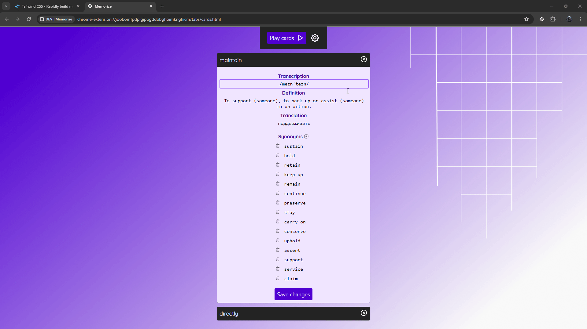
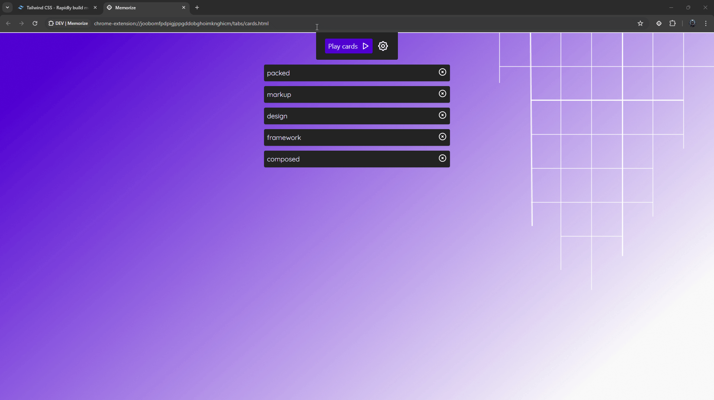

# Memorize

This is an extension that allows you to learn new English words passively. At any time, you can select an unfamiliar word on the page and see its definition, synonyms, context, transcription and listen to the word.

You can add the selected word to the dictionary, after which it can be viewed on a separate page as a card (like in Anki), and you can also add it to the list of words that will be highlighted on any web page.

There is also interval memory functionality.

### GIFs

